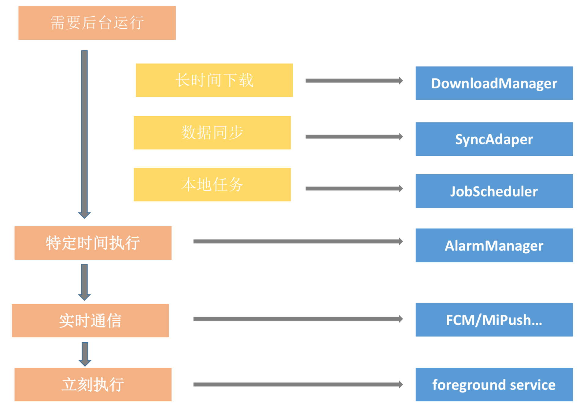

# 性能优化

## 一、布局优化

    1、删除布局中无用的控件和层次    开发者模式调试GPU过度绘制
    2、少使用性能较低的ViewGroup
    3、多使用<include> <merge> Viewstub
    4、onDraw 方法中不创建新的局部对象，不做耗时操作，不做循环操作

## 二、内存泄露

    1、静态变量导致
    2、属性动画忘记停止动画导致
    3、Handler内部类
    4、Context的正确使用
    5、线程滥用导致
    6、资源调用完后未及时关闭(Bitmap、Cursor、File、ContentProvider等)
    7、监听事情不需要时未及时关闭

### 三、电量优化 [查看详情](/StudyNotes/电量优化详情.md)

#### 优化的地方:

    1、屏幕
    2、CPU的运行状态 (WakeLock)
    3、网络
    4、传感器

#### 后台处理三个原则：

    1、减少,减少后台处理
    2、延迟,当设备充电时候再去执行
    3、合并,把多个处理任务合并在一起

#### 根据业务紧急情况选择执行的环境



#### 建议:

    1、平时做的内存优化，界面渲染优化，算法优化的时候就是在做电量的优化
    2、非马上执行的操作可以等到充电甚至连接WIFI的时候在执行
    3、了解wakelock的使用
    4、根据情况可以使用Jobscheduler/Alarm
    5、及时注销定位监听

## 四、启动优化

```
1、检测Application类中onCreate()方法的耗时
2、开线程初始化一些非必须在主线程初始化的第三方库
3、懒加载一些非必须使用的第三方库
4、应用中SplashActivity一般需要等待3秒再跳转到主界面，这时可以在SplashActivity界面预加载主界面的数据，
   再通过Intent传递到主界面
5、设置启动页的背景，给用户一种加载快的错觉
```

## 五、APK瘦身

```
1、分析包大小 build->Analyze APK 删除无用的图片，资源，第三方库
2、只用一套UI资源 720p xhdpi 在大部分机型上视觉差别不大
3、proguard 移除未使用的资源和代码
4、图片格式改变 从 png 到 tinypng 到 webp
5、引入 7zip 压缩方案
```
